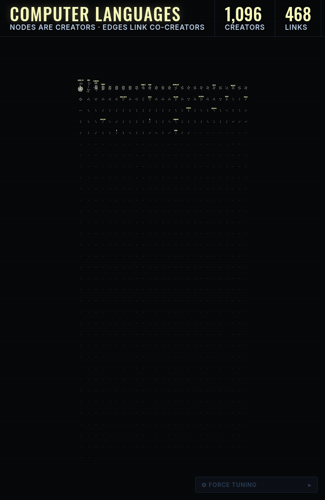

Building a programming language is mostly a solo job. Of the 1,182 languages in the Programming Language Database (PLDB) that name their creators, 85% list a single author.

A few weeks ago I got curious about how people collaborate to create computer languages. Then I came across PLDB, a public knowledge graph of computer languages. I projected the graph down to people, linking creators whenever they share a language. The results below are from a preliminary analysis.

The network shows that when creators connect, they form closed groups. The 472 creators who co-created a language form 148 separate connected components. 136 of them (92%) are complete graphs. Most cliques are tiny: 84 pairs, 26 trios, 10 groups of four, etc. And those 148 components split into 106 (72%) built from a single language.

The largest is a 16-person component spanning ALGOL 60, ALGOL 68, BNF, Fortran, FL, FP, Speedcoding, and Lisp. Next are a 13-person component spanning SQL, SEQUEL 2, SQUARE, and GML, a 9-person component over B, C, M4, awk, grep, and Go, and a 9-person Lisp component over Common Lisp, Scheme, Emacs Lisp, and Lisp Machine Lisp.

Overall, the network is sparse and fragmented. I honestly expected more connections. The 472 connected creators share 712 links, which represent only 0.64% of all possible pairs. Those links come from 176 multi-author languages. The largest component holds 16 people, 3% of the connected network. A null model confirms the fragmentation is real (a uniformly random graph with the same number of nodes and edges would have a giant component of ~400 people).

The graph also helped me find duplicate names. When several people are all credited as creators of the same language, they form a complete graph, so a missing edge is a clue: maybe the same person was listed under two different names. Checking every connected component with a swarm of agents returned 7 confirmed same-person pairs: John G. Kemeny = John George Kemeny (BASIC), Yann Le Cun = Yann LeCun, and so on. I contributed these corrections back to the PLDB repo, and they were merged upstream, so the corrected spellings are now part of the dataset itself.

Two caveats on this. PLDB records creators for only 1,182 of its 3,850 languages, and most of the rest name an origin lab instead. The creators it does record are individuals, with rare institutional exceptions. Counting those labs as creators would enlarge the network, but a lab is not a person, so this stays a network of creators. Also, "collaboration" means only sharing a language, which says nothing about later contributors or maintainers.